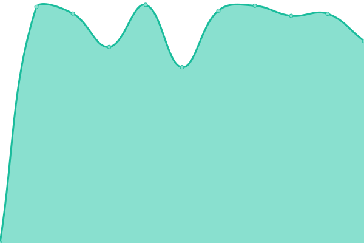

# [📈 Live Status](https://demo.upptime.js.org): <!--live status--> **🟩 All systems operational**

This repository contains the open-source uptime monitor and status page for [Upptime](https://upptime.js.org), powered by [Upptime](https://github.com/upptime/upptime).

With [Upptime](https://upptime.js.org), you can get your own unlimited and free uptime monitor and status page, powered entirely by a GitHub repository. We use [Issues](https://github.com/upptime/upptime/issues) as incident reports, [Actions](https://github.com/skywalkerRex/RexSky-Blog-Uptime/actions) as uptime monitors, and [Pages](https://demo.upptime.js.org) for the status page.

<!--start: status pages-->
<!-- This summary is generated by Upptime (https://github.com/upptime/upptime) -->
<!-- Do not edit this manually, your changes will be overwritten -->
<!-- prettier-ignore -->
| URL | Status | History | Response Time | Uptime |
| --- | ------ | ------- | ------------- | ------ |
|  [PT Site Main](https://qmain.rexsky-blog.com/) | 🟩 Up | [pt-site-main.yml](https://github.com/skywalkerRex/RexSky-Blog-Uptime/commits/HEAD/history/pt-site-main.yml) | 

 770ms
     
 | 

<a href="https://skywalkerRex.github.io/RexSky-Blog-Uptime/history/pt-site-main">100.00%</a>
    

|  [PT Site Home](https://qbit.rexsky-blog.com/) | 🟩 Up | [pt-site-home.yml](https://github.com/skywalkerRex/RexSky-Blog-Uptime/commits/HEAD/history/pt-site-home.yml) | 

 1324ms
     
 | 

<a href="https://skywalkerRex.github.io/RexSky-Blog-Uptime/history/pt-site-home">100.00%</a>
    

|  [Rex's Jellyfin](https://jellyfin.rexsky-blog.com/) | 🟩 Up | [rex-s-jellyfin.yml](https://github.com/skywalkerRex/RexSky-Blog-Uptime/commits/HEAD/history/rex-s-jellyfin.yml) | 

 1870ms
     
 | 

<a href="https://skywalkerRex.github.io/RexSky-Blog-Uptime/history/rex-s-jellyfin">100.00%</a>
    

|  [Music Converter](https://convert.rexsky-blog.com/) | 🟩 Up | [music-converter.yml](https://github.com/skywalkerRex/RexSky-Blog-Uptime/commits/HEAD/history/music-converter.yml) | 

 1319ms
     
 | 

<a href="https://skywalkerRex.github.io/RexSky-Blog-Uptime/history/music-converter">100.00%</a>
    

<!--end: status pages-->

[**Visit our status website →**](https://demo.upptime.js.org)

## 📄 License

- Powered by: [Upptime](https://github.com/upptime/upptime)
- Code: [MIT](./LICENSE) © [Upptime](https://upptime.js.org)
- Data in the `./history` directory: [Open Database License](https://opendatacommons.org/licenses/odbl/1-0/)
